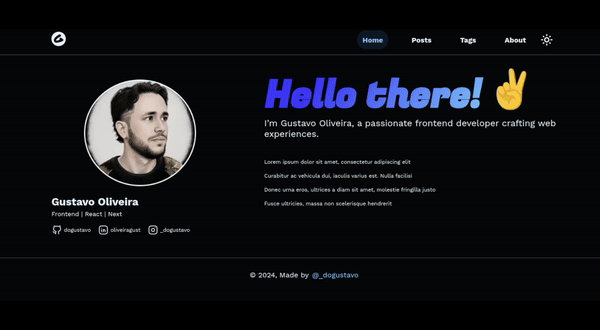
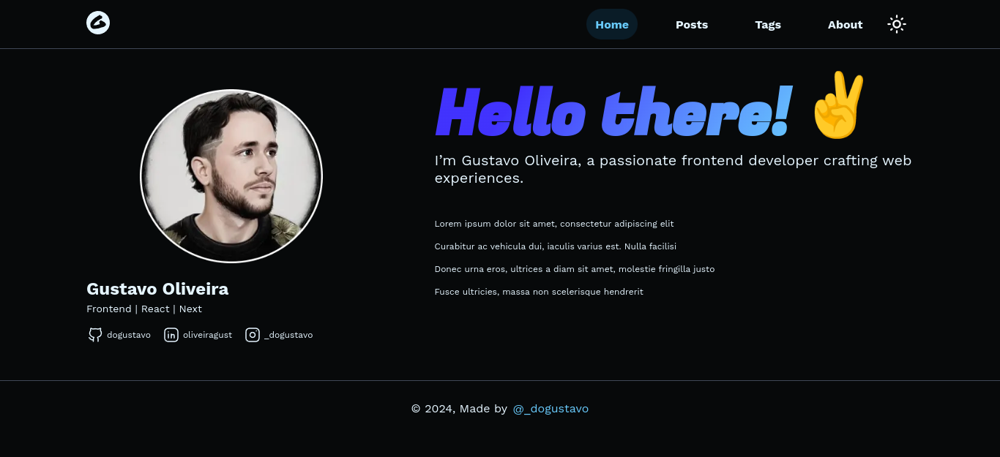
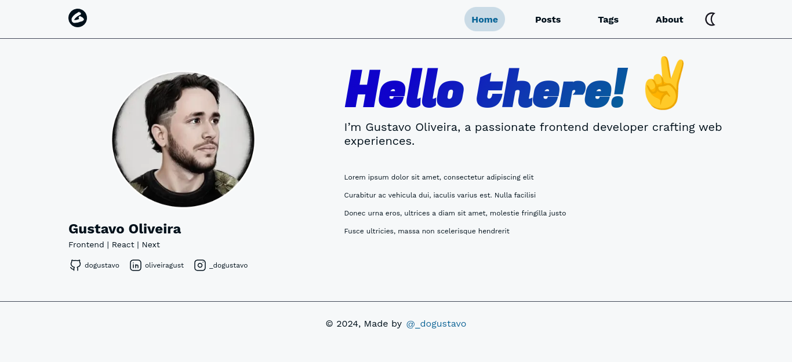
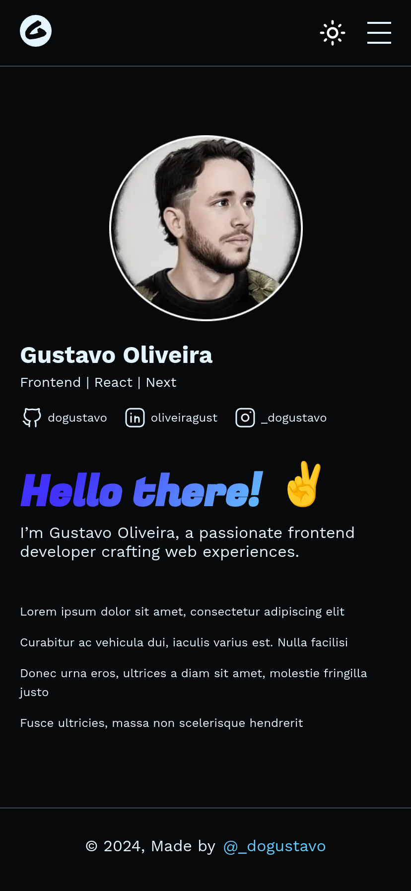
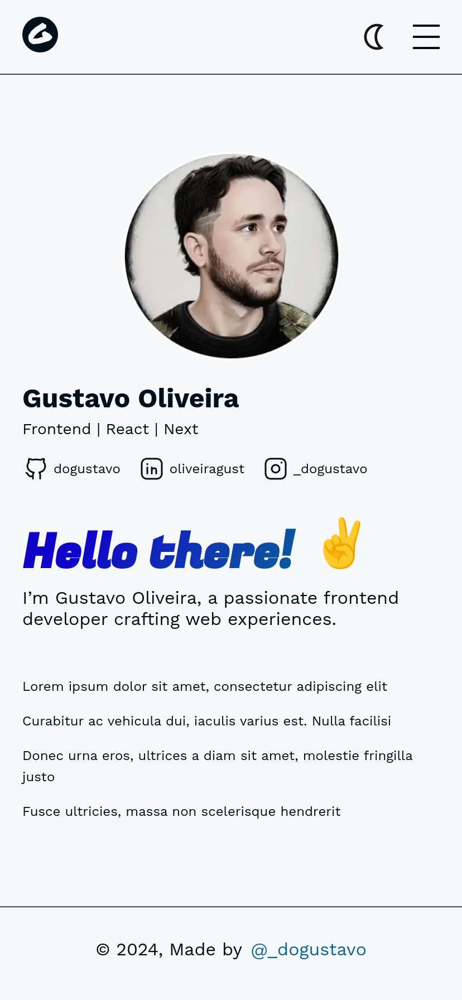
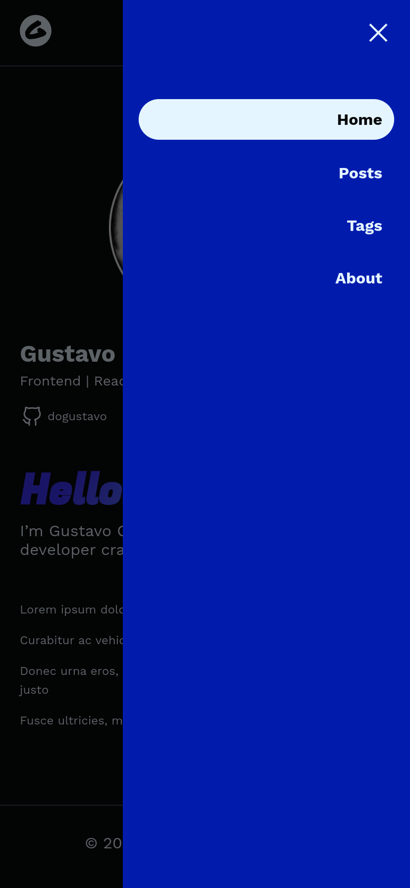
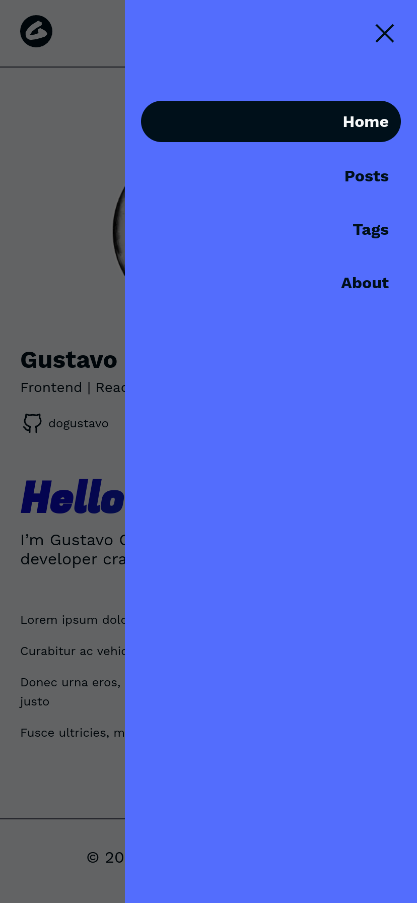
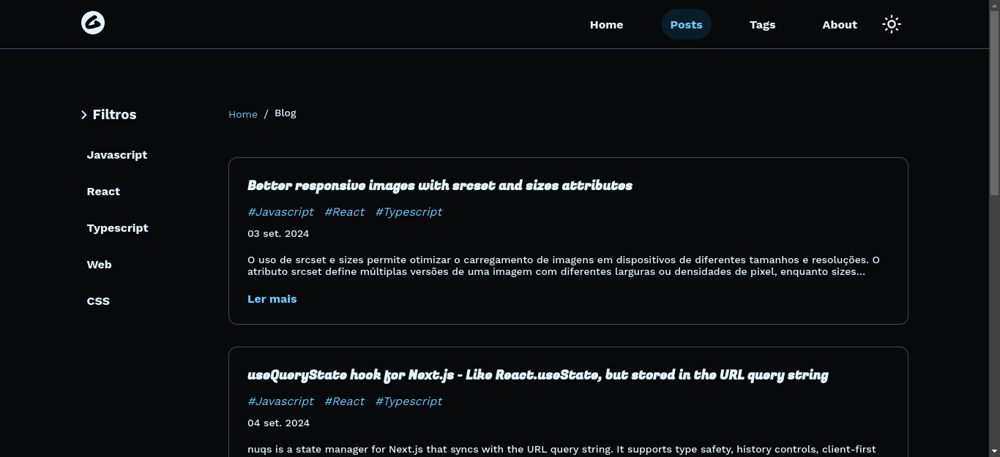
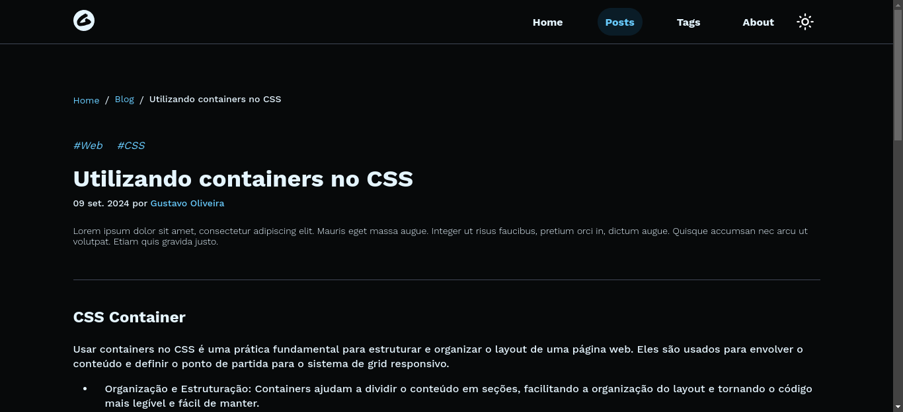

# Blog Pessoal - Frontend



Este repositório contém o código do frontend para o meu blog pessoal, desenvolvido com Next.js, React, SCSS e TypeScript. Para conhecer o CMS que está servindo os dados para a contrução do blog basta acessar [aqui](https://github.com/dogustavo/strapi-v4-blog).

## Tecnologias Utilizadas

- **Next.js** v14
- **React** v18
- **SCSS** para estilização
- **TypeScript** para tipagem estática

## Pré-requisitos

- [Node.js](https://nodejs.org/) (versão recomendada: 16 ou superior)
- [npm](https://www.npmjs.com/) ou [yarn](https://yarnpkg.com/)

## Como Rodar o Projeto

### Passo 1: Configurar as Variáveis de Ambiente

Crie um arquivo `.env` na raiz do projeto e adicione as seguintes variáveis:

```
NEXT_PUBLIC_API_BASE_URL= #URL QUE APONTA PARA A API DO STRAPI
NEXT_PUBLIC_API_BASE_TOKEN= #TOKEN DE ACESSO DAS URLS PÚBLICAS DO STRAPI
```

### Passo 2: Instalar as Dependências

Navegue até o diretório do projeto e instale as dependências necessárias:

```bash
npm install
# ou
yarn install
```

### Passo 3: Iniciar o Servidor de Desenvolvimento

Inicie o servidor de desenvolvimento com o comando:

```
npm run dev
# or
yarn dev
```

### Telas do sistema

<div align="center">
<table>
  <tr>
    <td>
       
      </td>
    <td>
      
    </td>
  </tr>
  <tr>
    <td>
       
      </td>
    <td>
      
    </td>
  </tr>
  <tr>
    <td>
       
      </td>
    <td>
      
    </td>
  </tr>
  <tr>
    <td>
       
      </td>
    <td>
      
    </td>
  </tr>
 </table>
</div>
